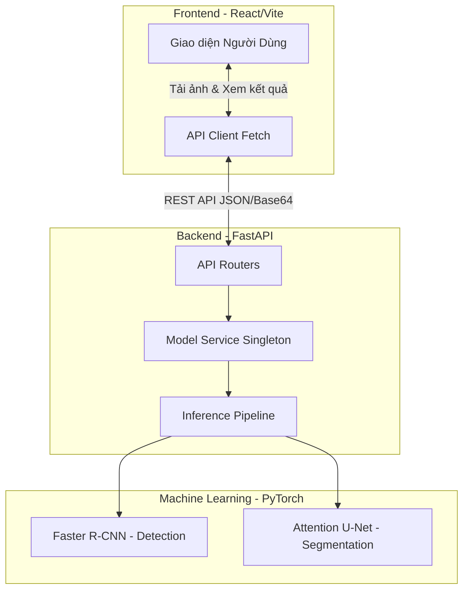
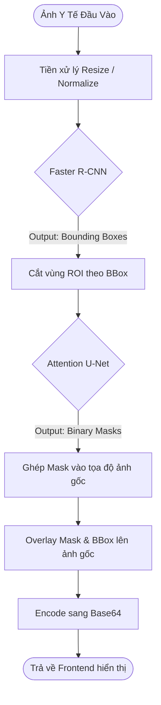
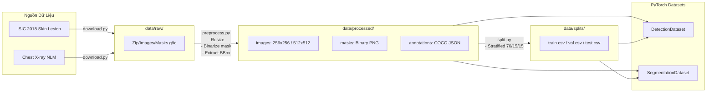

# Kiến Trúc và Tổ Chức Dữ Liệu - MedSeg

Dưới đây là các sơ đồ minh họa cách hệ thống MedSeg hoạt động và cách dữ liệu được tổ chức.

## 1. Kiến Trúc Hệ Thống Tổng Thể (System Architecture)

Hệ thống được chia làm 3 lớp chính: Frontend (Giao diện), Backend API (Xử lý request), và ML Models (Xử lý AI).

---

## 2. Luồng Phân Tích (Inference Pipeline Flow)

Đây là cách một bức ảnh y tế đi qua hệ thống AI từ khi được người dùng upload cho đến khi trả về kết quả cuối cùng trên màn hình.

---

## 3. Cấu Trúc và Tổ Chức Dữ Liệu (Data Organization)

Quá trình luân chuyển dữ liệu từ lúc tải về cho đến khi được đưa vào Dataset để training.

### Giải thích Tổ chức Data:
1. **`data/raw/`**: Lưu trữ nguyên bản các file zip hoặc ảnh vừa tải về từ nguồn (Kaggle, NLM). Không bao giờ chỉnh sửa trực tiếp trên file này.
2. **`data/processed/`**: Dữ liệu đã qua tiền xử lý bởi `preprocess.py` (đồng nhất kích thước, chuyển mask về ảnh nhị phân đen/trắng, tạo file JSON format COCO chứa bounding boxes để train Faster R-CNN).
3. **`data/splits/`**: Chứa các file CSV lưu danh sách tên file thuộc tập `train`, `val`, `test` để đảm bảo mỗi lần train data chia giống hệt nhau (Reproducibility).
4. **`PyTorch Datasets`**: Lúc train, `DetectionDataset` sẽ đọc ảnh và file COCO JSON, còn `SegmentationDataset` sẽ đọc ảnh và file Mask (PNG).
